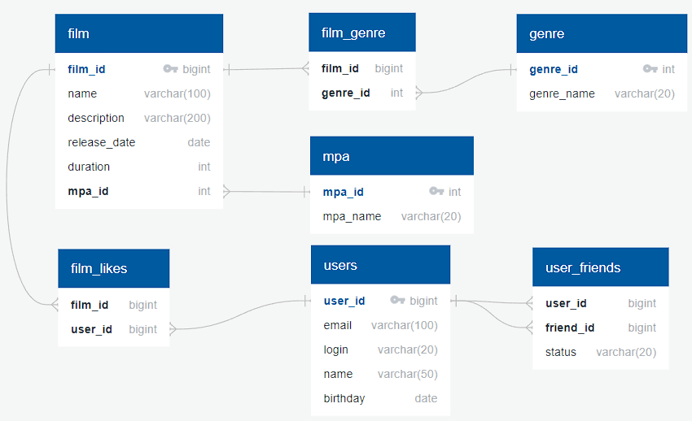

# java-filmorate

DB Schema:



## Exemplary SQL Queries

### Films

Get All Films:  
```sql 
SELECT * FROM film;
```
Get Top Films:  
```sql
SELECT film_id FROM film_likes  
GROUP BY film_id  
ORDER BY COUNT(user_id);
```

Get Film By Id:  
```sql
SELECT * FROM film  
WHERE film_id={id};
```

### Users

Get All Users:
```sql
SELECT * FROM user;
```

Get Friends List For User:  
```sql
SELECT friend_id FROM user_friends  
WHERE user_id={id};
```

Get Common Friends List:
```sql
SELECT friend_id FROM user_friends  
WHERE user_id={id1}  
AND friend_id IN (SELECT friend_id FROM user_friends
                    WHERE user_id={id2});
```

Get User By Id
```sql
SELECT * FROM user  
WHERE user_id={id};
```